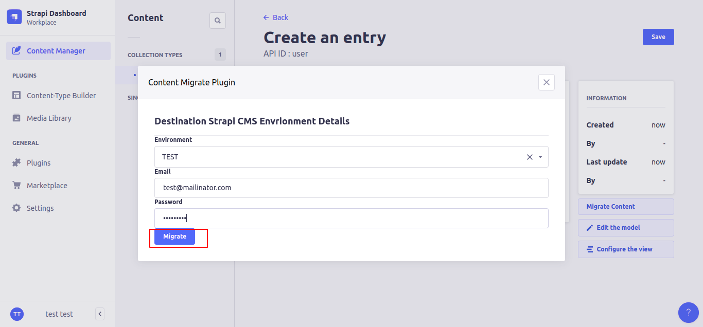

# Strapi Plugin Migrate Content

This plugin allows content manangers to migrate the contents from one Strapi CMS environment to other environment.

# How to install:

1.  In a root folder of your strapi project run `npm install @nitin.tejuja12/strapi-plugin-migrate-content --save`
2.  Rebuild admin UI `strapi build`
3.  Run `strapi develop`

# Configuration

Configure your Different Strapi CMS Environment Urls in plugin config
`config/plugins.js`

```
module.exports = ({ env }) => ({
    'strapi-plugin-migrate-content': {
        enabled:true,
        config:{
            environmentUrls:{
                'TEST':'http://test.strapicms.com',
                'PROD':'http://prod.strapicms.com'
            }
        }
    },
});
```

# How to use plugin:

1. Open Content manager section in Admin panel of Strapi CMS.
2. Go to any Collection type and open any record and hit `Migrate Content` button as shown in below image
   
3. Select your Destination Strapi CMS Envrionment and enter your credentials of destination environment.
4. Hit `Migrate` button to start the process of migrating the data from your current environment to destination environment.
   
